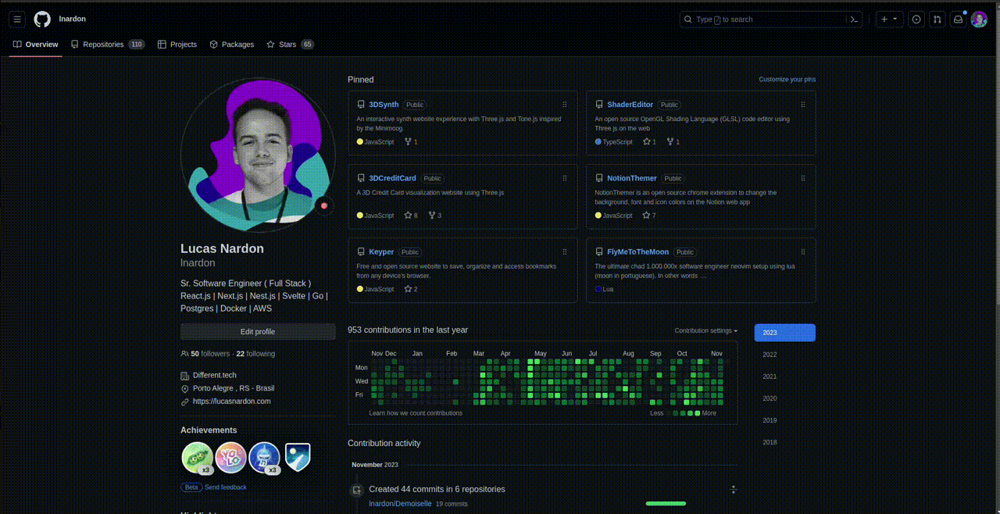

# Demoiselle

A chrome extension to change the way to interact with the browser by adding a floating menu and a quick search bar to the page.

## Demo



## Installation

- First Download the extension by clicking here => (https://github.com/lnardon/Demoiselle/archive/main.zip)
- Unzip it and go to your Chrome extensions tab
- Enable Developer Mode on the page
- Click on the "Load Unpacked" Button and choose the folder you extracted the extension to

```
 To open the searchbar press Alt + s
```

\*Demoiselle was a series of aircrafts built in France by the Brazilian aviation pioneer Alberto Santos-Dumont.
